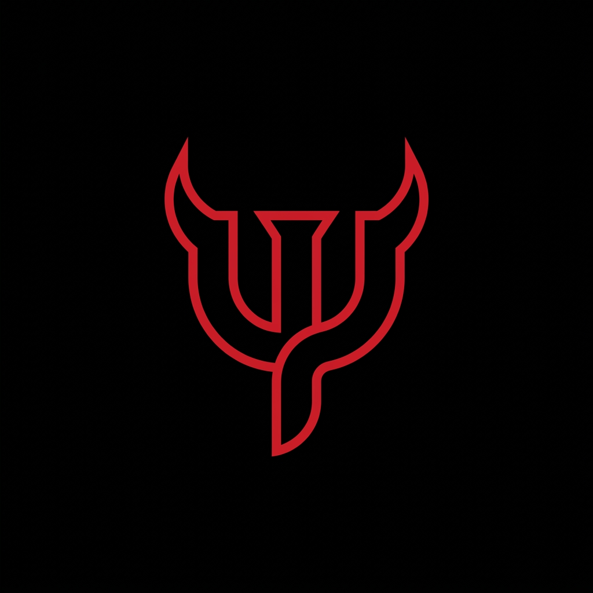

<div align="center">



# ⚡ DEMON ENGINE
### **Quantum-Inspired Consensus Middleware for AI Agents & Critical Systems**

[](https://www.python.org/)
[](LICENSE)
[](#-performance)
[](#-the-three-phases)

**A specialized, ultra-lightweight algorithmic layer designed to replace brute-force trial-and-error generation in LLMs with probabilistic wave interference and phase-coherence collapse.**

[Dashboard Interattiva (index.html)](index.html) • [Meccanica Matematica](DEMON_MECHANICS.md) • [Principi e Limiti](LIMITS_AND_RULES.md)

---

</div>

## 🌌 The Biological Inspiration

In natural systems (such as the Fenna-Matthews-Olson light-harvesting complex in photosynthetic plants), energy excitons do not search for the reaction center via classical sequential trial-and-error. Instead, they traverse multiple molecular pathways simultaneously in **quantum superposition**, converging onto the optimal path with ~99% quantum efficiency.

**Demon Engine** brings this paradigm to agentic AI and multi-hypothesis systems:
- It eliminates the need for expensive secondary neural verifiers.
- It computes pairwise phase differences using semantic and contractual invariants.
- Contradictory hallucinations cancel out via destructive interference ($\Delta\phi \to \pi$), while concordant truth patterns amplify into a stationary Eigenstate in **$<0.05\text{ ms}$**.

---

## ⚡ The Three Phases

```
      [ Multiple Parallel Hypotheses / LLM Outputs ]
                           │
                           ▼
          Phase 1: SUPERPOSITION (|Ψ⟩)
          Each state is assigned amplitude A_i and invariant phase.
                           │
                           ▼
          Phase 2: WAVE INTERFERENCE (I_ij)
          I_ij = A_i * A_j * cos(Δϕ_ij)
          • Invariant overlap: Constructive amplification (cos > 0)
          • Antipatterns & conflicts: Destructive cancellation (cos < 0)
                           │
                           ▼
          Phase 3: EIGENSTATE COLLAPSE
          Normalized probability density R_i = (A_i^eff)^2.
          Instant selection of the coherent, noise-free state.
```

---

## 🚀 Quick Start

### Installation
Clone the repository:
```bash
git clone https://github.com/YOUR_USERNAME/demon-engine.git
cd demon-engine
```

### Basic Usage
```python
from demon_engine import DemonEngine, DemonHypothesis

engine = DemonEngine(phase_damping=1.2, antipattern_penalty=0.85)

hypotheses = [
    DemonHypothesis(
        id="H1",
        name="Naive Async Sleep",
        content="time.sleep(1)",
        invariants={"cache_read"},
        antipatterns={"blocking_call"}
    ),
    DemonHypothesis(
        id="H2",
        name="Non-Blocking Lock",
        content="async with asyncio.Lock(): ...",
        invariants={"cache_read", "non_blocking_concurrency"},
        antipatterns=set()
    )
]

result = engine.collapse("Concurrency Decision", hypotheses)
print(f"Winner: {result.eigenstate.name} ({result.coherence_percentage:.1f}%)")
# Output: Winner: Non-Blocking Lock (98.4%)
```

---

## 📊 Industrial Test Benchmarks

| Scenario | Tested Problem | Destructive Cancellations | Execution Time |
| :--- | :--- | :---: | :---: |
| **Async Concurrency** | Race condition vs `asyncio.Lock` | 5 | **0.03 ms** |
| **Financial Contract** | Float precision loss vs `Decimal` | 5 | **0.03 ms** |
| **Security Decision** | Blind admin bypass vs MFA Dry-Run | 5 | **0.04 ms** |

---

## 🖥️ Interactive Simulation Dashboard

Demon Engine includes a zero-dependency local dashboard (`index.html`).  
Open `index.html` in any browser to visualize the wave collapse, the dynamic phase matrix, and the real-time suppression of hallucinated states.

---

## 📜 License
MIT License. Created for safe, deterministic, high-efficiency AI systems.
